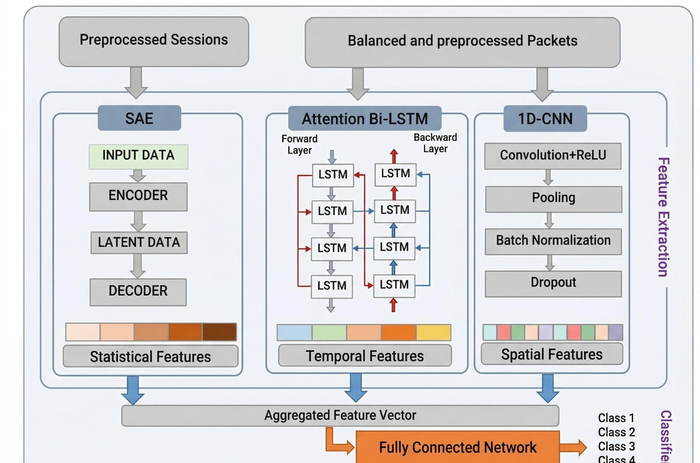
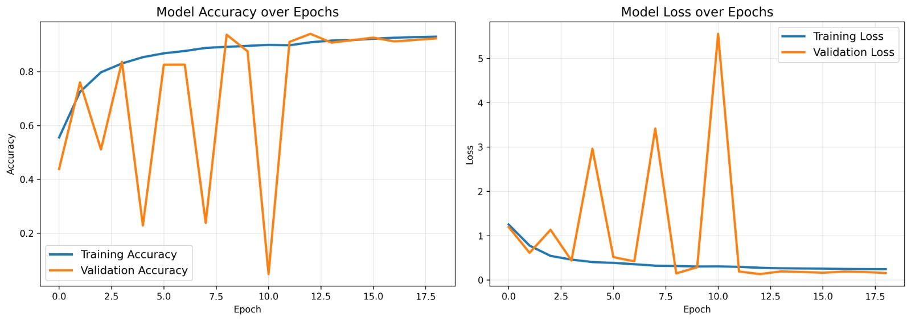
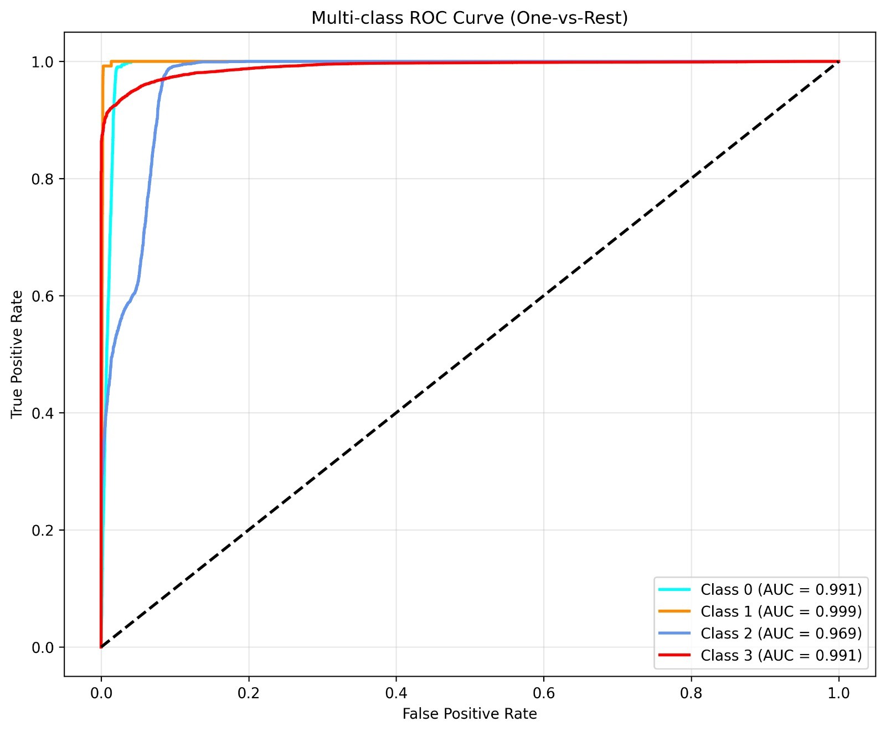
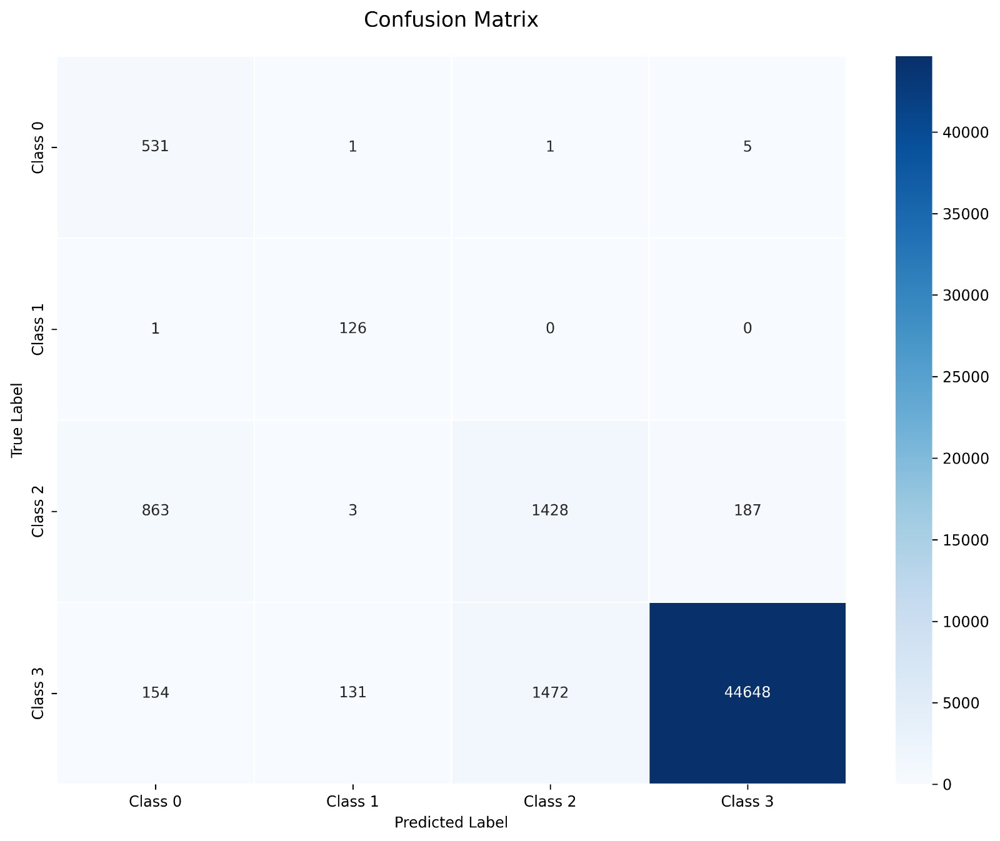

# CBS: Encrypted Traffic Classification

A practical implementation of the CBS paper ("A Deep Learning Approach for Encrypted Traffic Classification With Mixed Spatio-Temporal and Statistical Features").

---
##  Overview

This repository contains the preprocessing pipeline and model implementation for classifying encrypted network traffic using a multi-branch deep learning approach (1D-CNN + Bi-LSTM + Statistical features).

**Achieved Test Accuracy:** 94.86%

---
## Architecture


---
## Tech Stack
- Python
- PyTorch
- NumPy / Pandas
- Scikit-learn
- Deep Learning (CNN, LSTM, GAN)

---
## Dataset
- ISCX VPN-NonVPN 2016 Dataset  
- Dataset Link:- [Click Here](https://www.unb.ca/cic/datasets/vpn.html) 

For more info about dataset [Click Here](./data/data.md)

---
## Project Structure

| Project Structure |
| --- |
| ├── assets/ |
| ├── data/ |
| ├── preprocessing/ |
| ├── models/ |
| ├── results/ |
| ├── requirements.txt |
| └── README.md |


---
## Key Features

- Classifies encrypted traffic (VPN vs Non-VPN)
- Multi-class classification (chat, streaming, email, etc.)
- No payload inspection required
- Memory-safe batch processing for large pcap files
- Fixed-length packet extraction (1500 bytes)
- Statistical feature extraction for SAE branch
- Multi-branch fusion model (Spatial + Temporal + Statistical)
- Class weight handling for imbalance


---
## Requirements

See `requirements.txt`


---
## How to Use

1. Clone the repository

```bash
git clone https://github.com/goelumanshi/Epics_Project.git

cd repo-name

pip install -r requirements.txt

```
2. Download dataset [Click Here](https://www.unb.ca/cic/datasets/vpn.html) 
3. Extract it
4. Open `models/cbs_model_training.ipynb` in Google Colab
5. Run the notebook (GPU recommended)

---
##  Preprocessing Pipeline

### The preprocessing includes:

- Reading and labeling pcap files
- Header + payload extraction to 1500-byte records
- Normalization (0-1 range)
- Statistical feature computation (mean, std, min, max, percentiles)
- Subsampling and global shuffling

### Files Overview

- `read_pcap_files.py`  
  Reads raw PCAP files and extracts packet-level data.

- `load_pcap_datatype.py`  
  Converts PCAP data into structured formats suitable for processing.

- `extract_header_payload_packets.py`  
  Extracts relevant packet information (headers & payload patterns) while removing unnecessary fields.

- `extract_statistical_features.py`  
  Computes statistical features such as packet count, duration, and size distribution.

- `normalize_extracted.py`  
  Normalizes extracted features to a standard scale for efficient model training.

- `subsample_and_shuffle.py`  
  Handles dataset balancing, subsampling, and randomization to improve model generalization.

---
## Results
| Metric | Value |
|------|------|
| Accuracy | 94.86% |
| Weighted F1 | 94.80% |
| Macro F1 | 60.43% |
| Precision (Weighted)| 95.41%|
| Recall (Weighted) | 94.86%|

- Binary Classification Accuracy: **~99.6%**
- Improved performance using feature fusion


### Training Performance

- The model shows steady improvement in training accuracy, reaching ~94%.
- Validation accuracy fluctuates due to class imbalance and dataset complexity.
- Loss decreases overall, indicating effective learning.

### Multi-Class ROC Curve

- Class 1 achieves near-perfect classification (AUC = 0.999)
- Class 0 and Class 3 also perform strongly (~0.99 AUC)
- Class 2 shows relatively lower performance (AUC = 0.969), indicating difficulty in classification

###  Confusion Matrix

- The confusion matrix shows how well the model classifies each traffic class.
- Most predictions lie along the diagonal, indicating correct classifications.
- Some misclassifications are observed between certain classes, especially minority classes.
- This aligns with the lower Macro F1-score (~60%), indicating imbalance in class-wise performance.


---
## Limitations

- Used 4-class mapping instead of the paper's 12 classes due to hardware constraints
- Statistical branch uses dense layers (not full SAE)
- Packet-level approach (not full flow/session aggregation)

---
## Future Work

- Implement true 12-class labeling from raw pcaps
- Add full Stacked Autoencoder for statistical branch
- Integrate session/flow-level features
- Experiment with GAN-based augmentation

---
## License

MIT License
